<p align="center">
    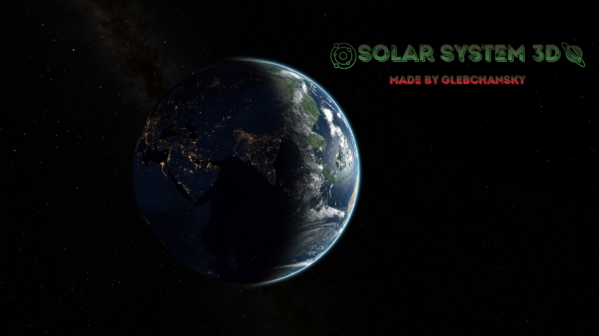
</p>

<div align="center">
  <a href="https://vk.com/glebchanskyy">
    
  </a>

  <a href="https://www.instagram.com/glebchansky__">
    
  </a>

  <a href="https://github.com/GlebchanskyGit/SolarSystem-3D/blob/main/LICENSE.md">
    
  </a>
</div>

<details open="open">
  <summary><h2>Table of contents</h2></summary>
  <ul>
    <li><a href="#overview">Overview</a></li>
    <li><a href="#features">Features</a></li>
    <li><a href="#dependencies">Dependencies</a></li>
    <li><a href="#building-windows">Building (for Windows)</a></li>
    <li><a href="#runtime-asset-hosting">Runtime asset hosting</a></li>
    <li><a href="#limitations">Limitations</a></li>
    <li><a href="#screenshots-and-videos">Project screenshots and video snippets</a></li>
      <ul>
      <li><a href="#earth">Earth</a></li>
      <li><a href="#earth-clouds-shadow">The shadow of the clouds on Earth</a></li>
      <li><a href="#view-from-moon-to-earth">View from the Moon to Earth</a></li>
      <li><a href="#phobos-background-mars">Phobos in the background of Mars</a></li>
      <li><a href="#jupiter">Jupiter</a></li>
      <li><a href="#saturn-flyover-video">A video snippet of a flyover of Saturn</a></li>
      <li><a href="#saturn">Saturn</a></li>
      <li><a href="#saturn-with-titan-from-behind">Saturn with Titan from behind</a></li>
      <li><a href="#saturn-with-mimas-and-titan">Saturn with Mimas and Titan</a></li>
      <li><a href="#shadow-of-titan">Shadow of Titan</a></li>
      <li><a href="#uranus">Uranus</a></li>
      <li><a href="#uranus-from-behind">Uranus from behind</a></li>
      <li><a href="#triton-background-neptune">Triton in the background of Neptune</a></li>
      <li><a href="#pluto">Pluto</a></li>
      <li><a href="#sun">Sun</a></li>
      <li><a href="#sun-modified-1">Sun with modified parameters 1</a></li>
      <li><a href="#sun-modified-2">Sun with modified parameters 2</a></li>
      </ul>
  </ul>
</details>

<h2 id="overview">Overview</h2>

The project is an animated 3D scene with a model of the Solar System.

<h2 id="features">Features</h2>

- 🎮 First-person camera control with acceleration and zoom capabilities
- 🖼️ High resolution textures (8K+) with `dds` extension
- 🖼️ Photoshop-processed skybox with high resolution textures (6K)
- 💡 High-quality shaders
- 💡 Blinn–Fong reflection model with normal maps to visualise surface irregularities
- 💡 Accurate atmospheric scattering of planets and satellites
- 💡 Mie scattering and accurate shadows for planetary rings
- 💡 High-quality soft shadows using PCF and ray tracing
- 💡 Omnidirectional shadow maps simulation when using a single unidirectional shadow map
- 💡 Shadows from the clouds
- 💡 Lens flare
- 🎵 Background music
- ⚙️ FreeType status hints plus a browser settings panel for quality, time control, pause,
  and shadows
- ⚙️ Using 3D models with `obj` extension for planets, satellites, planetary rings, etc.

<h2 id="web-porting">Web Porting (Emscripten)</h2>

See [PORTING_GUIDE.md](PORTING_GUIDE.md) for detailed instructions on how to convert this project to run in a web browser using WebGL 2.

<h2 id="dependencies">Dependencies</h2>

- [C++17](https://en.cppreference.com/w/cpp/17)
- [OpenGL 4.6](https://www.khronos.org/registry/OpenGL/specs/gl/glspec46.core.pdf)
- [GLFW](https://github.com/glfw/glfw)
- [GLEW](https://github.com/nigels-com/glew)
- [SDL2](https://www.libsdl.org/download-2.0.php) and [SDL2_image](https://www.libsdl.org/projects/SDL_image/)
- [Assimp](https://github.com/assimp/assimp)
- [FreeType](https://gitlab.freedesktop.org/freetype/freetype)
- [irrKlang](https://www.ambiera.com/irrklang/)

<h2 id="building-windows">Building</h2>

### For Windows (Native)
Run an auxiliary script from the command line to automatically run the necessary [cmake](https://cmake.org/install/)
commands using the `.\build.sh` command, while in the directory with the root `CMakeLists.txt` file 
(the root project folder). Then an exe file with all necessary dlls will appear in the `build` folder.

### For Web (Emscripten)
To build for the web using WebAssembly:

1. Install the [Emscripten SDK](https://emscripten.org/docs/getting_started/downloads.html)
2. Activate the Emscripten environment: `source /path/to/emsdk/emsdk_env.sh`
3. Build the project:
```bash
emcmake cmake -B build-web .
cd build-web
emmake make
```
4. Serve the generated HTML file (due to CORS restrictions):
```bash
python3 -m http.server 8000
# Then open http://localhost:8000/SolarSystem.html
```

See [PORTING_GUIDE.md](PORTING_GUIDE.md) for detailed information about the WebAssembly port.

### Web Development Assets

The Vite development server uses same-origin runtime assets by default. After `./build-web.sh`,
the bundled low-resolution placeholders are available under `web/public/resource/textures_low/`,
so local development does not depend on the production CDN:

```bash
cd web
npm run dev
# Open http://localhost:5173/solar-system/
```

To test against a remote or alternate asset host, set `VITE_ASSET_BASE` to the base URL that
contains the `resource/` directory. Include the trailing slash:

```bash
VITE_ASSET_BASE=https://test.1ink.us/solar-system/ npm run dev
```

The override is optional. Without it, dev, preview, and production all resolve runtime assets
relative to the deployed Vite base URL.

### Web simulation controls

The **Simulation** panel in the upper-right corner controls the running C++/WASM scene without
requiring URL parameters. Quality, time scale, pause, and shadow preferences are saved in
`localStorage` and restored on the next visit. An explicit `?quality=low|medium|full` URL value
still overrides the saved quality for shareable test links. The panel uses 44-48 px controls and
collapses on small screens so it remains practical on touch devices.

<h2 id="runtime-asset-hosting">Runtime asset hosting</h2>

The multi-gigabyte high-resolution DDS files and music are release artifacts, not source-code
artifacts. The recommended production design is **object storage (S3, R2, or B2) behind a CDN,
using a versioned immutable prefix**, with [`resource/asset-manifest.json`](resource/asset-manifest.json)
as the inventory and integrity contract. For example:

```text
https://assets.example.com/solar-system/2026.07.0/
└── resource/
    ├── asset-manifest.json
    ├── textures/
    │   ├── Earth_Day_Diffuse.dds
    │   └── Main_SkyBox/PositiveX.dds
    ├── textures_low/
    │   └── Earth_Day_Diffuse_Low.dds
    └── sounds/
        └── Stellardrone - Galaxies.mp3
```

Set the public asset origin when building or starting Vite. The value is the directory that
contains `resource/`, not the `resource/` directory itself:

```bash
VITE_ASSET_BASE=https://assets.example.com/solar-system/2026.07.0/ npm run build
```

Vite embeds `VITE_ASSET_BASE` in the frontend bundle and `web/src/main.ts` publishes the normalized
value as `window.__solarSystemAssetBase`. `WebResourceFetcher` then resolves every
`resource/...` request against it. When the variable is unset, assets remain same-origin under
the deployed Vite base (normally `/solar-system/resource/...`). The value is public configuration,
so it must never contain credentials or signed secrets.

### Distribution options

| Option | Assessment |
|---|---|
| Object storage + CDN | **Recommended.** Handles several GB cheaply, supports immutable version prefixes, range requests, CORS, and independent app/asset deploys. |
| GitHub Releases | Useful as a versioned recovery source or for downloadable asset archives. Multi-part bundles and release bandwidth make it less convenient as the browser's hot path. |
| Separate Git LFS repo | Acceptable as an authoring source with a deploy hook, but LFS quotas and checkout/deploy overhead still require a serving origin. Do not point the browser at Git LFS URLs. |
| Content-addressed manifest | Recommended as a verification layer on top of object storage. Fill each manifest `sha256` after publishing; changing content requires a new asset version rather than overwriting a cached key. |

The committed manifest lists every bundled low-resolution DDS, every runtime-hosted high-resolution
DDS referenced by the application, and the optional sound files.
`sha256` may be `null` while an asset is unavailable in a source checkout. The deploy command verifies
every non-null checksum and refuses to publish if a required listed asset is missing. Low-resolution
placeholders stay in git and are also uploaded under `resource/textures_low/` for staged requests.

### Required HTTP headers

For a same-origin asset tree, no CORS header is needed. For a separate asset origin used by
`emscripten_async_wget2`/XHR, every DDS, MP3, and manifest response (including error responses)
must include:

```http
Access-Control-Allow-Origin: https://app.example.com
Cross-Origin-Resource-Policy: cross-origin
```

`Access-Control-Allow-Origin: *` is also valid because these requests do not use credentials.
The app document currently uses `Cross-Origin-Embedder-Policy: require-corp` and
`Cross-Origin-Opener-Policy: same-origin`; CORS-enabled XHR satisfies COEP, while
`Cross-Origin-Resource-Policy: cross-origin` keeps the asset response explicitly compatible.
The asset origin itself does not need to emit COEP or COOP.

The production app and representative low/high DDS and WASM responses at
`test.1ink.us/solar-system/` were audited on 2026-07-13. They returned `require-corp`,
`same-origin`, `Access-Control-Allow-Origin: *`, and `Cross-Origin-Resource-Policy: cross-origin`.
The current DDS cache lifetime is two days; for versioned asset prefixes use:

```http
Cache-Control: public, max-age=31536000, immutable
```

Keep `asset-manifest.json` on a shorter cache lifetime only if a stable alias points at the newest
version. A manifest inside an immutable version directory can use the immutable policy too.

For an S3-compatible origin, publish the three directories first and the manifest last. This makes
the manifest the completion marker for a release (adapt the endpoint/profile flags for R2 or B2):

```bash
ASSET_URI=s3://solar-system-assets/solar-system/2026.07.0/resource
aws s3 sync resource/textures/ "$ASSET_URI/textures/" --cache-control 'public,max-age=31536000,immutable'
aws s3 sync resource/textures_low/ "$ASSET_URI/textures_low/" --cache-control 'public,max-age=31536000,immutable'
aws s3 sync resource/sounds/ "$ASSET_URI/sounds/" --cache-control 'public,max-age=31536000,immutable'
aws s3 cp resource/asset-manifest.json "$ASSET_URI/asset-manifest.json" --cache-control 'public,max-age=31536000,immutable'
```

Background music uses the same origin and `VITE_ASSET_BASE` resolution as textures. The five
Stellardrone MP3 files live under `resource/sounds/` and are **not** embedded in the WASM
`.data` bundle (they are stored via Git LFS and may be absent in local checkouts). At runtime
the web build downloads them asynchronously in parallel with core assets:

- `[Audio] Starting optional background music download (5 tracks)...`
- `[Audio] Loaded track: resource/sounds/...` when a CDN/local file is present
- `[Audio] Missing track (skipped): resource/sounds/...` on 404 or offline hosts

Missing tracks do not block the loading screen or crash SDL_mixer; playback starts once at
least one track is available. Use the settings panel **Music volume** slider or **Mute music**
toggle (persisted in `localStorage`) to control output. Page Up/Page Down still adjust volume
from the keyboard.

Configure CORS on the bucket and response-header/CORP injection on the CDN before switching
`VITE_ASSET_BASE` to the new version. Keep the previous version prefix available for rollback.

### Separate deployment

`web/deploy.py` has independent `app` and `assets` targets. It reads connection details from the
environment, checks SSH host keys, validates the asset manifest, and never stores credentials in
the repository:

```bash
export SOLAR_DEPLOY_HOST=files.example.com
export SOLAR_DEPLOY_USER=deploy
export SOLAR_DEPLOY_KEY_FILE="$HOME/.ssh/solar-assets"
export SOLAR_DEPLOY_APP_REMOTE=public_html/solar-system
export SOLAR_DEPLOY_ASSET_REMOTE=public_html/solar-assets/2026.07.0/resource

cd web
python3 deploy.py app       # uploads dist/ only
python3 deploy.py assets    # uploads resource/{textures,textures_low,sounds} + manifest
# Or publish both explicitly:
python3 deploy.py all
```

`SOLAR_DEPLOY_PASSWORD` is supported for CI but a key or an interactive password is preferred.
Use `--dry-run` to inspect an upload without connecting. SFTP cannot set HTTP response headers;
configure the headers and cache policy on the web server, bucket, or CDN distribution.

<h2 id="limitations">Limitations</h2>

Due to virtual memory limitations (mainly if the executable file is compiled with a 32-bit 
compiler and uses 32-bit libraries, as in my case), a `bad_alloc` exception may be thrown when 
launching the entire Solar System at once (with all planets, satellites, etc.).

<h2 id="screenshots-and-videos">Project screenshots and video snippets</h2>

If you want to see all the beauties of the Solar System in person,
[download](https://github.com/GlebchanskyGit/SolarSystem-3D/releases) the archive and run the 
executables I've specially prepared for you.

More screenshots and video snippets can be seen [here](https://ibb.co/album/8Y7GLh?sort=date_asc&page=1).

<h3 id="earth">Earth</h3>
<p align="center">
    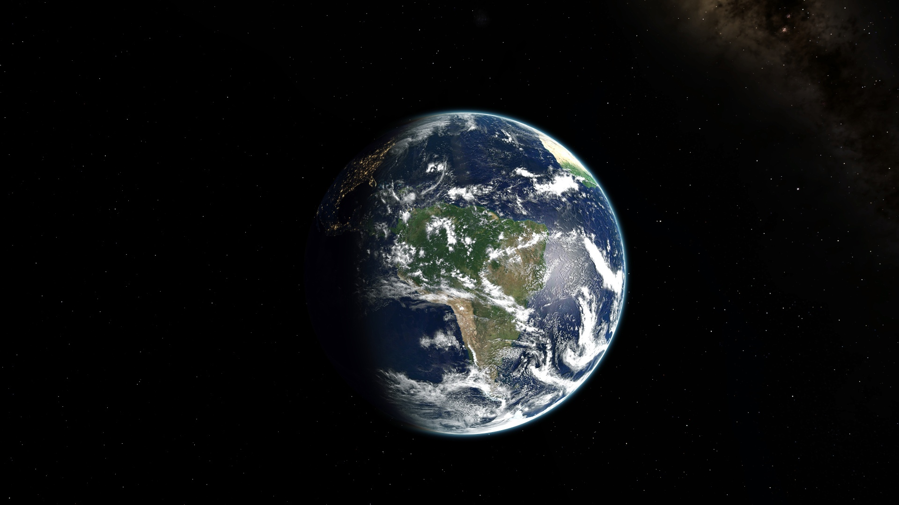
</p>

<h3 id="earth-clouds-shadow">The shadow of the clouds on Earth</h3>
<p align="center">
    
</p>

<h3 id="view-from-moon-to-earth">View from the Moon to Earth</h3>
<p align="center">
    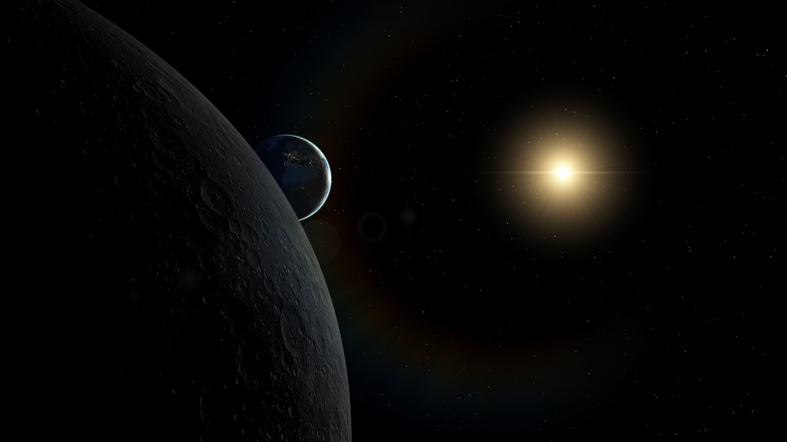
</p>

<h3 id="phobos-background-mars">Phobos in the background of Mars</h3>
<p align="center">
    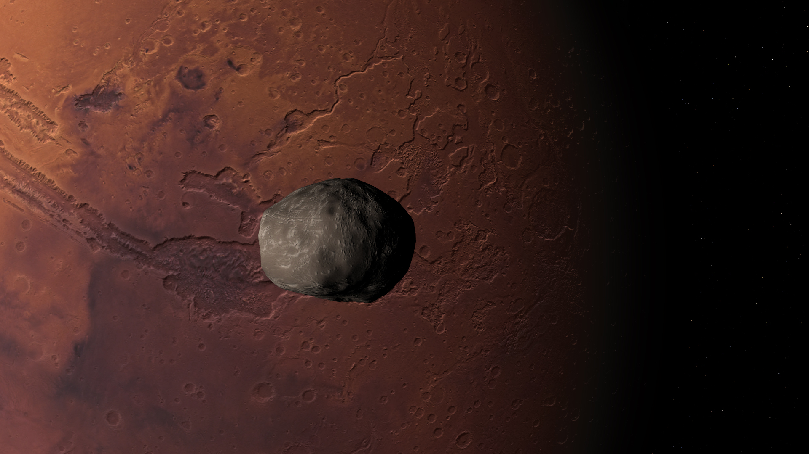
</p>

<h3 id="jupiter">Jupiter</h3>
<p align="center">
    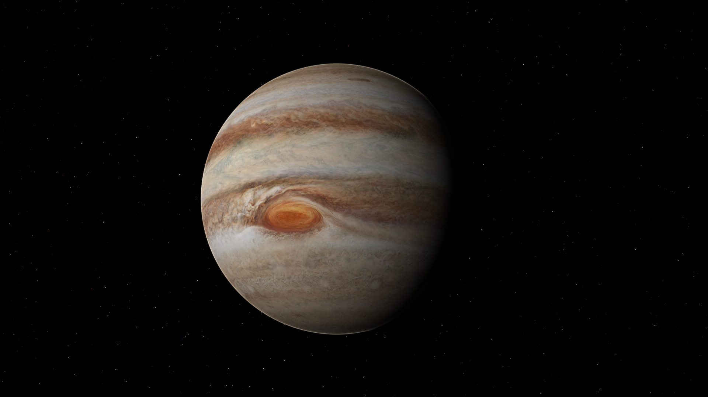
</p>

<h3 id="saturn-flyover-video">A video snippet of a flyover of Saturn</h3>
<p align="center">
    
</p>

<h3 id="saturn">Saturn</h3>
<p align="center">   
    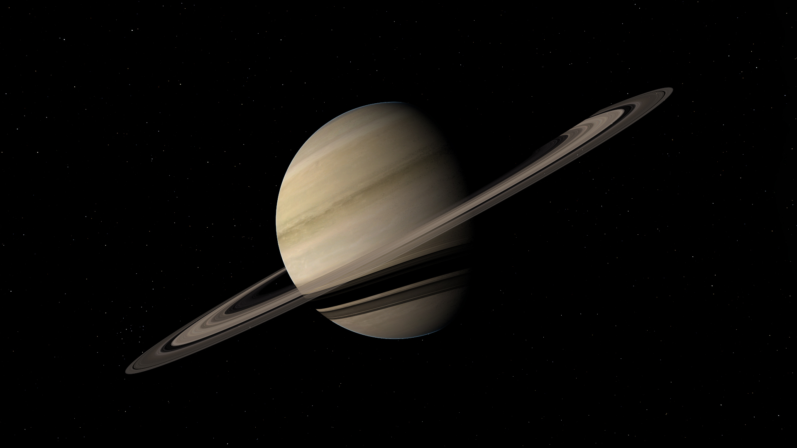
</p>

<h3 id="saturn-with-titan-from-behind">Saturn with Titan from behind</h3>
<p align="center">   
    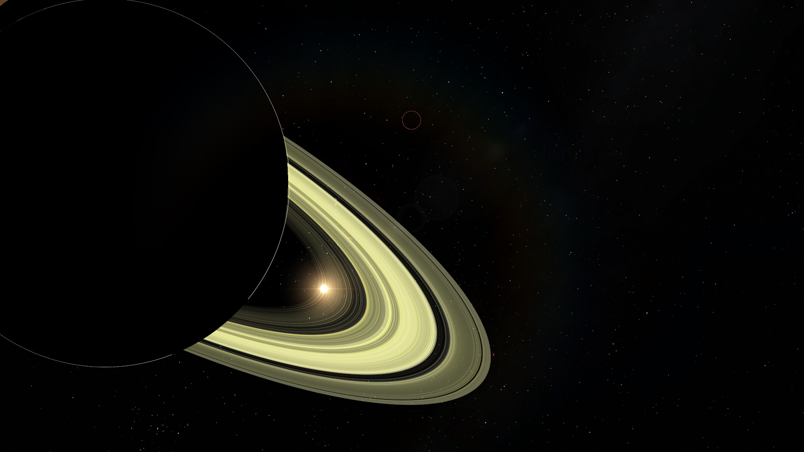
</p>

<h3 id="saturn-with-mimas-and-titan">Saturn with Mimas and Titan</h3>
<p align="center">   
    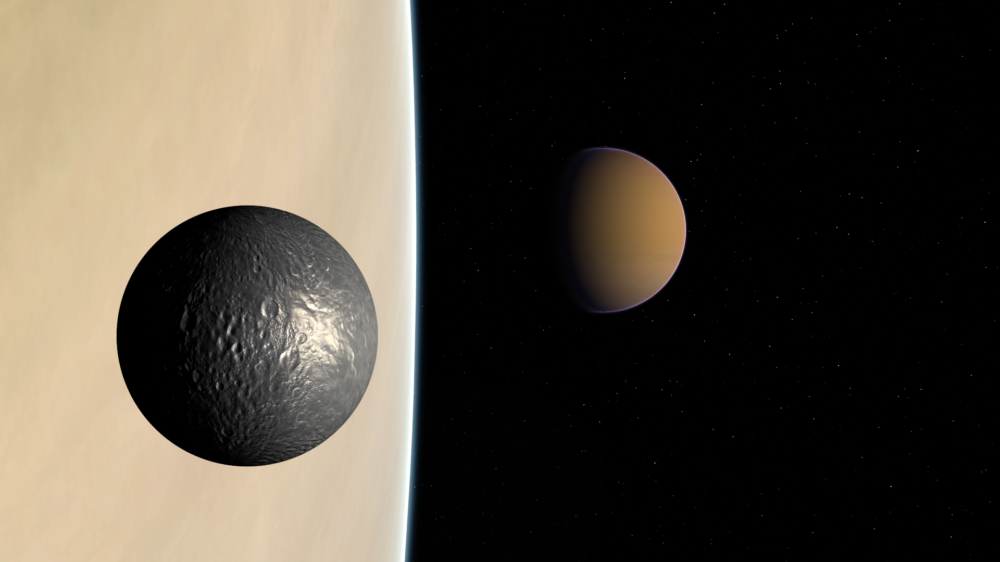
</p>

<h3 id="shadow-of-titan">Shadow of Titan</h3>
<p align="center">   
    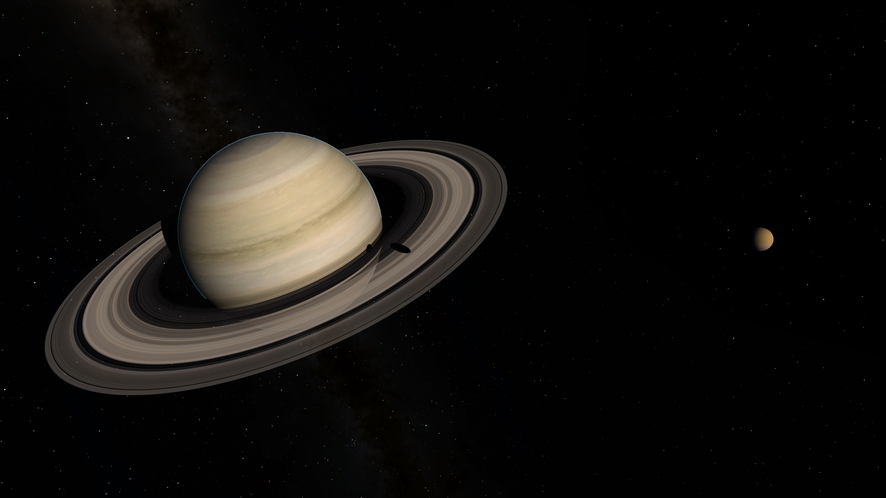
</p>

<h3 id="uranus">Uranus</h3>
<p align="center">   
    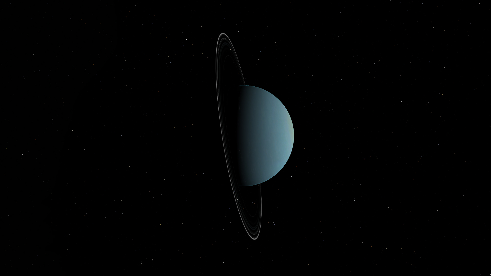
</p>

<h3 id="uranus-from-behind">Uranus from behind</h3>
<p align="center">   
    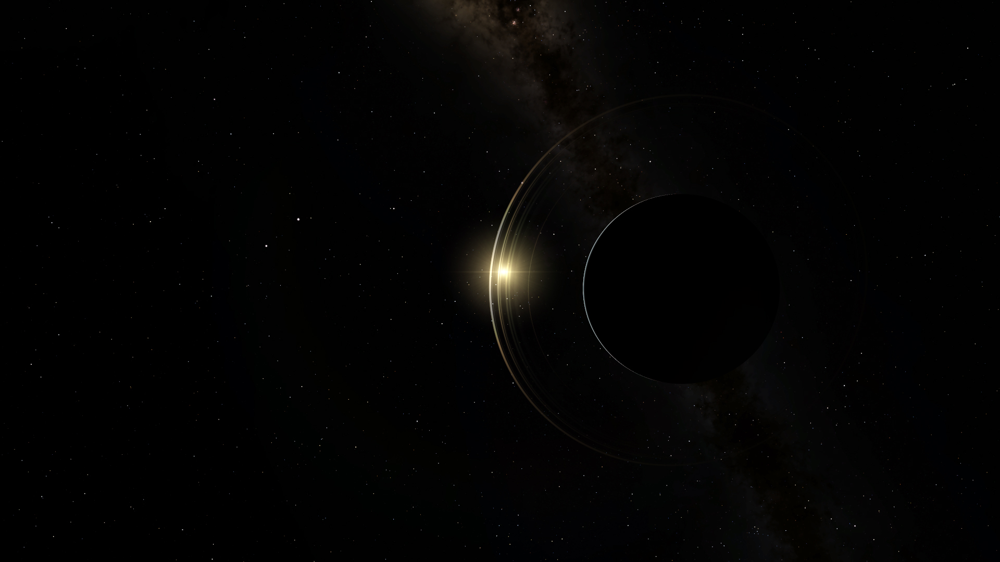
</p>

<h3 id="triton-background-neptune">Triton in the background of Neptune</h3>
<p align="center">
    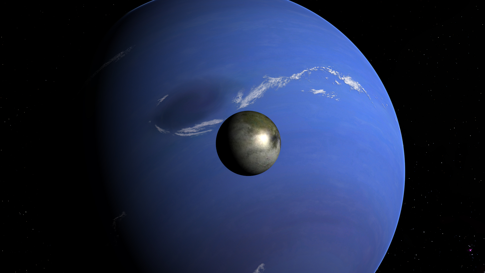
</p>

<h3 id="pluto">Pluto</h3>
<p align="center">
    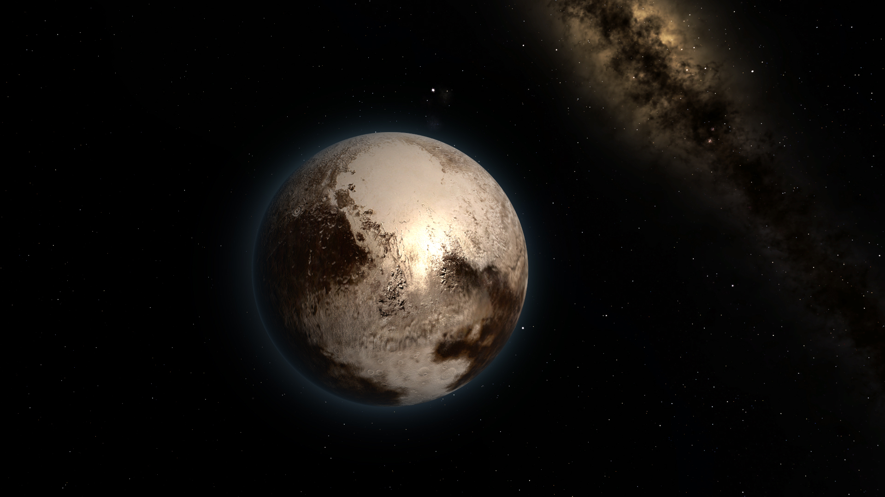
</p>

<h3 id="sun">Sun</h3>
<p align="center">
    
</p>

<h3 id="sun-modified-1">Sun with modified parameters 1</h3>
<p align="center">
    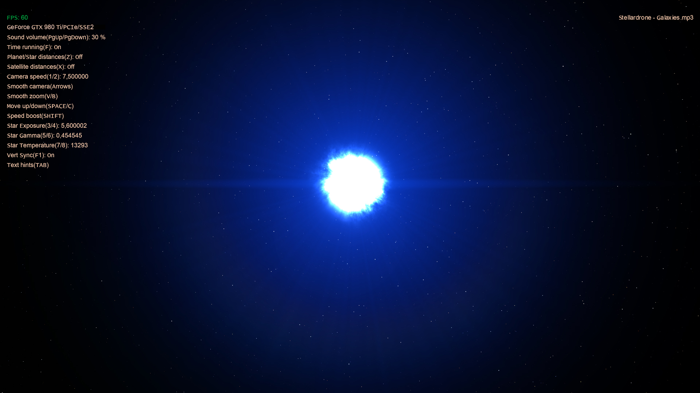
</p>

<h3 id="sun-modified-2">Sun with modified parameters 2</h3>
<p align="center">
    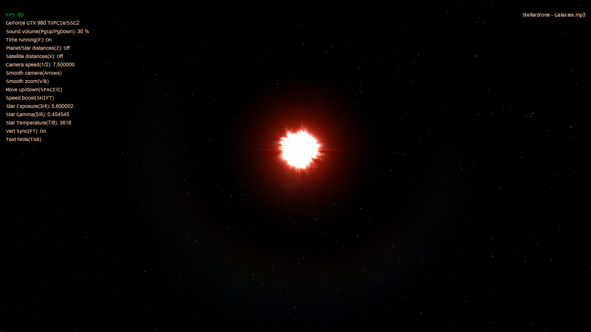
</p>
